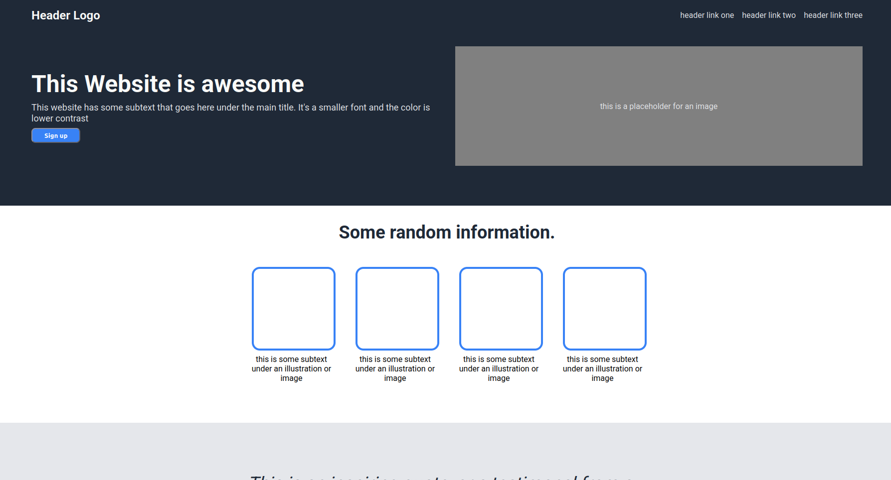
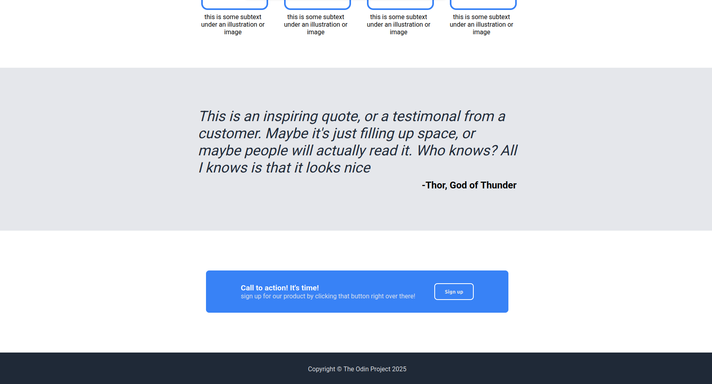

# Landing Page Project - The Odin Project

This project shows my foundational HTML and CSS skills. The goal was to replicate a provided design for a landing page from scratch, focusing heavily on Flexbox for layout.

## Screenshot and Demo

[Live Demo](https://laym00n.github.io/odin-landing-page/)

## Features

* A header with a logo and navigation links.
* A hero section with a title, subtext, a sign-up button, and an image placeholder.
* An information section with four content cards arranged horizontally.
* An inspiring quote section.
* A call-to-action banner with a sign-up button.
* A simple footer.

## Technologies Used

* **HTML5:** For the structure and semantic markup of the page.
* **CSS3:** For all styling, including colors, fonts, and spacing.
* **Flexbox:** Used as the primary tool for creating all major page layouts.
* **Git & GitHub:** For version control and hosting the project on GitHub Pages.
